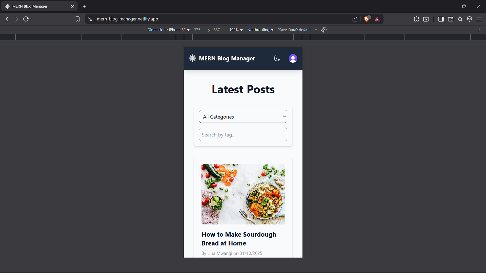

# MERN Blog Manager

A full-stack MERN application designed for creating, managing, and sharing blog content. It features an interactive dashboard for content management and a clean, public-facing view for individual posts. The application is built with a modern tech stack, including secure authentication via Clerk, a RESTful API backend, and a responsive React frontend styled with Tailwind CSS.

The project serves as a comprehensive demonstration of MERN stack integration — from API design and database modeling to component-based frontend architecture and state management.

## Deployment

- **Frontend (Netlify):** [https://your-netlify-app-name.netlify.app/](https://your-netlify-app-name.netlify.app/)
- **Backend (Render):** [https://mern-stack-integration-masmunge95.onrender.com/](https://mern-stack-integration-masmunge95.onrender.com/)

## Features

- **Full CRUD for Posts & Categories**: Create, read, update, and delete posts and their categories through a sleek admin dashboard.
- **Secure User Authentication**: Sign up, sign in, and manage sessions securely with [Clerk](https://clerk.com/).
- **Featured Image Uploads**: Upload and manage featured images for your blog posts using `multer`.
- **Single Post View**: A clean, responsive page to display individual posts by URL.
- **Server-Side Validation**: Robust backend validation with `express-validator` to maintain data integrity.
- **Dark/Light Mode**: Built-in theme switching powered by React Context.
- **Pagination**: Smooth navigation even for large datasets of posts and categories.
- **Dynamic Welcome Messages**: Each dashboard load displays a new motivational message to inspire creativity.

## Tech Stack

- **Frontend**: React, Vite, Tailwind CSS, React Router  
- **Backend**: Node.js, Express.js  
- **Database**: MongoDB with Mongoose  
- **Authentication**: Clerk  
- **API Communication**: Axios
- **File Uploads**: Multer  

## Screenshots

*(Add screenshots of your application here. For example: Task list view, Add task form, API posts view, etc.)*




## Project Structure

```
mern-blog/
├── client/                 # React front-end
│   ├── public/             # Static files
│   ├── src/                # React source code
│   │   ├── components/     # Reusable components
│   │   ├── context/        # React context providers
│   │   ├── hooks/          # Custom React hooks
│   │   ├── pages/          # Page components
│   │   ├── services/       # API services
│   │   └── App.jsx         # Main application component
│   └── package.json        # Client dependencies
├── server/                 # Express.js back-end
│   ├── config/             # Configuration files
│   ├── controllers/        # Route controllers
│   ├── middleware/         # Custom middleware
│   ├── models/             # Mongoose models
│   ├── routes/             # API routes
│   ├── utils/              # Utility functions
│   ├── server.js           # Main server file
│   └── package.json        # Server dependencies
└── README.md               # Project documentation
```

## Getting Started & Setup

### Prerequisites
- Node.js (v18 or higher)
- MongoDB (local installation or MongoDB Atlas)
- Clerk account for authentication keys

### 1. Clone the Repository
First, clone the project to your local machine.

```bash
git clone https://github.com/your-username/mern-blog.git
cd mern-blog
```

### 2. Backend Setup
Navigate to the server directory and install the required dependencies.

```bash
cd server
npm install
```

Next, create a `.env` file in the server directory and add the following environment variables. Replace the placeholder values with your actual keys.

```ini
NODE_ENV=development
PORT=5000
MONGO_URI=your_mongodb_connection_string
CLERK_SECRET_KEY=your_clerk_secret_key
```

### 3. Frontend Setup
In a new terminal, navigate to the client directory and install its dependencies.

```bash
cd ../client
npm install
```

Then, create a `.env` file in the client directory and add your Clerk Publishable Key.

```ini
VITE_CLERK_PUBLISHABLE_KEY=your_clerk_publishable_key
```

### 4. Run the Application
You will need two separate terminal windows to run both the client and server concurrently.  

**Terminal 1 (Backend):**
```bash
cd server
node server.js
```

**Terminal 2 (Frontend):**
```bash
cd client
npm run dev
```

The application will be available at [http://localhost:5173](http://localhost:5173).

## API Documentation

| Method  | Endpoint              | Description                    |
|----------|----------------------|--------------------------------|
| `GET`    | `/api/posts`         | Get all blog posts             |
| `POST`   | `/api/posts`         | Create a new blog post         |
| `GET`    | `/api/posts/:id`     | Get a single blog post by ID   |
| `PUT`    | `/api/posts/:id`     | Update a blog post by ID       |
| `DELETE` | `/api/posts/:id`     | Delete a blog post by ID       |
| `GET`    | `/api/categories`    | Get all categories             |
| `POST`   | `/api/categories`    | Create a new category          |
| `PUT`    | `/api/categories/:id`| Update a category by ID        |
| `DELETE` | `/api/categories/:id`| Delete a category by ID        |
| `POST`   | `/api/upload`        | Upload a single image          |

## Troubleshooting

1. **Module Not Found Errors (Client)**  
   - **Issue:** Errors like `Failed to resolve import 'axios'` or missing dependencies.  
   - **Fix:** Run `npm install` in the `client` directory. Ensure packages such as `axios`, `react-router-dom`, and `prop-types` are installed.

2. **Incorrect Import Paths**  
   - **Issue:** Components fail to load due to misreferenced paths.  
   - **Fix:** A `@` alias was added in `vite.config.js` to reference the `src` directory for cleaner imports, e.g. `import Component from '@/components/Component'`.

3. **API 404 Errors in Development**  
   - **Issue:** Frontend requests to `/api/...` return 404.  
   - **Fix:** A proxy in `vite.config.js` forwards `/api` and `/uploads` requests to the backend server running on `http://localhost:5000`.

---

**Happy coding and blogging! 🚀**